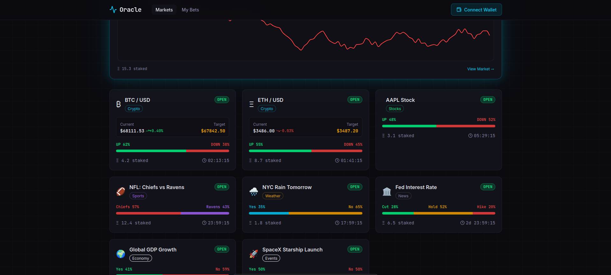
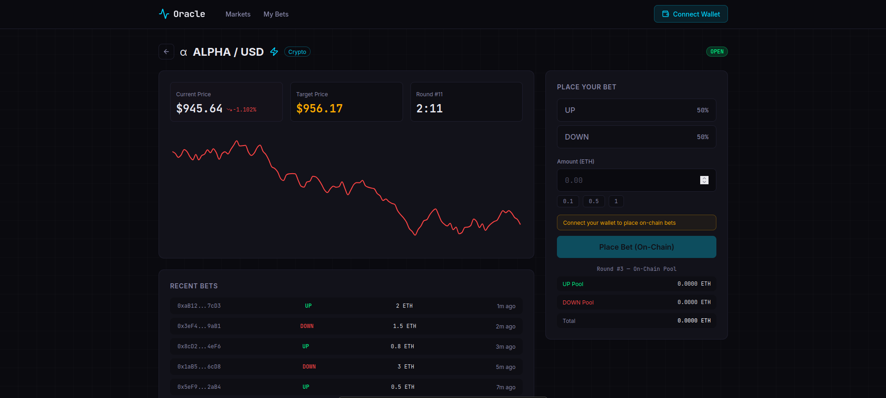
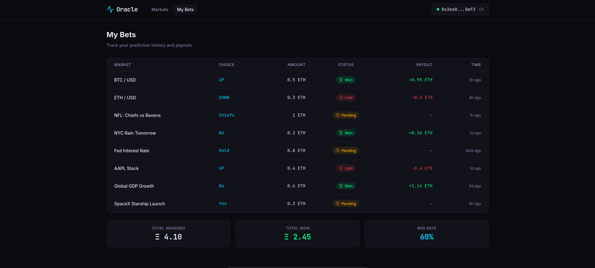

# Oracle — Decentralized Prediction Market Platform

A decentralized prediction market where users bet on real-world outcomes using crypto. **Chainlink CRE** (Compute Runtime Environment) is the oracle layer — it fetches real-world data, verifies it cryptographically across a decentralized network, and writes the result onchain. The smart contract then automatically pays winners.

Built for the [Chainlink Convergence Hackathon](https://chain.link/hackathon) (Feb 6 – Mar 8, 2026).

**Track:** Prediction Markets | **Bonus:** Tenderly Virtual TestNets

**Demo Video:** [Watch on Vimeo](https://vimeo.com/1171464314)

---

## Screenshots

| Home — Market Grid | Alpha Market — Trading View | My Bets — Portfolio Tracker |
|---|---|---|
|  |  |  |

---

## Architecture

```
User places bet via MetaMask (Frontend)
        ↓
Smart Contract holds funds (Tenderly Virtual TestNet)
        ↓
Round timer expires / Event fires / Admin triggers
        ↓
CRE Workflow fires (cron / EVM log / HTTP trigger)
        ↓
CRE fetches result from external API (HTTP / AI / Confidential)
        ↓
CRE writes verified result onchain (signed report → EVM write)
        ↓
Smart Contract reads result → pays winners automatically
        ↓
Frontend updates (wallet balance changes, round resolved)
```

The platform demonstrates a complete oracle-powered DeFi application. Users interact with a React frontend that connects to MetaMask. Bets are placed as real ETH transactions on a Tenderly Virtual TestNet. When it's time to resolve a market, a CRE workflow fetches the real-world result from an external source, reaches consensus across nodes, and writes a cryptographically signed report onchain. The smart contract verifies the report, determines winners, and allows them to claim proportional payouts.

---

## Project Structure

```
chainlink/
├── frontend/      React + Vite — trading terminal UI, MetaMask wallet integration
├── server/        Express API — Alpha price feed (random walk simulation)
├── contracts/     Solidity + Hardhat — PredictionMarket.sol, deploy & resolve scripts
└── workflows/     CRE workflows — 10 oracle pipelines covering all trigger types
```

---

## Markets & CRE Workflows

We built **10 CRE workflows** covering **all 3 trigger types**, **6 different external data sources**, and multiple consensus strategies. Each workflow is a fully independent oracle pipeline that fetches data, determines an outcome, and settles a market onchain.

| # | Market | Workflow | Trigger | Data Source | CRE Features |
|---|--------|----------|---------|-------------|--------------|
| 1 | Alpha (dev) | `alpha-workflow` | Cron | Internal server | HTTPClient, EVM read/write, median consensus |
| 2 | BTC/USD | `crypto-price-workflow` | Cron | CoinGecko API | HTTPClient, EVM read/write, median consensus |
| 3 | ETH/USD | `eth-price-workflow` | Cron | CoinGecko API | HTTPClient, EVM read/write, median consensus |
| 4 | AAPL Stock | `stock-price-workflow` | Cron | Yahoo Finance | HTTPClient, EVM read/write, median consensus |
| 5 | NFL Game | `sports-workflow` | EVM Log | Gemini AI + Google Search | LogTrigger, Secrets, AI grounding, identical consensus |
| 6 | NYC Weather | `weather-workflow` | Cron | OpenWeatherMap | **ConfidentialHTTPClient**, Secrets, identical consensus |
| 7 | Fed Rate | `ai-news-workflow` | Cron | Gemini AI + Google Search | HTTPClient, Secrets, AI grounding, identical consensus |
| 8 | AI Consensus | `multi-model-workflow` | Cron | Gemini + OpenAI | Multi-model FBA pattern, dual Secrets, identical consensus |
| 9 | On-Demand | `ondemand-workflow` | HTTP | Admin request payload | **HTTP Trigger**, ECDSA auth, EVM read/write |
| 10 | Audit Trail | `audit-trail-workflow` | EVM Log | Onchain events → Firestore | LogTrigger, Secrets, Firebase REST API |

**All 3 CRE trigger types demonstrated:** Cron (scheduled), EVM Log (event-driven), HTTP Inbound (user-initiated).

---

## Workflow Details

### Price Oracle Workflows (Alpha, BTC, ETH, AAPL)

These workflows follow the same pattern: a cron trigger fires on a schedule, the workflow fetches a live price from an external API, compares it to a baseline to determine UP or DOWN, reads the current round from the smart contract, and writes a `resolveRound()` transaction onchain.

- **Alpha** fetches from our internal Express server (random walk simulation around $1000)
- **BTC/USD** and **ETH/USD** fetch from the CoinGecko public API (no API key needed) and compare against the nearest $1000/$100 baseline
- **AAPL Stock** fetches from Yahoo Finance and compares the current price against the previous market close

All four use `median` consensus for price values — each CRE node fetches the price independently, and the network takes the median to prevent any single node from manipulating the result. The final UP/DOWN outcome uses `identical` consensus (all nodes must agree).

### AI-Powered Workflows (Fed Rate, Sports, AI Consensus)

These workflows use large language models with internet access to resolve subjective or real-world questions.

- **Fed Rate** (`ai-news-workflow`) — A cron-triggered workflow that sends a question (e.g., "Will the Fed cut interest rates by March 2025?") to **Google Gemini** with **Google Search grounding** enabled. Gemini searches the internet for current information and returns a structured `YES/NO/INCONCLUSIVE` verdict with a confidence score (0–10000). If the AI is inconclusive, the workflow skips resolution to avoid settling on uncertain data.

- **Sports** (`sports-workflow`) — An **EVM Log-triggered** workflow. Instead of a cron, it listens for a `SettlementRequested` event emitted by the smart contract. When someone calls `requestSettlement(marketId, question)` onchain, CRE detects the event, extracts the question from the event data, and sends it to Gemini with Google Search grounding. This demonstrates event-driven oracle resolution — the market is settled in response to an onchain action, not a timer.

- **AI Consensus** (`multi-model-workflow`) — Queries **both Gemini and OpenAI GPT-4o** independently with the same question. Uses a **First-Best-Agreement (FBA) safety pattern**: the market only settles if both models agree on the same answer. If they disagree or either returns INCONCLUSIVE, resolution is blocked. This prevents settlement on ambiguous or contested outcomes. Confidence is set to the minimum of the two models' scores.

### Weather Workflow

Uses **ConfidentialHTTPClient** (not the standard HTTPClient) to call the OpenWeatherMap API. This CRE feature protects the API key in a multi-node environment — the key is never exposed to individual nodes. The workflow checks the weather condition code: codes 200–599 indicate rain (YES), anything else is NO.

### On-Demand Settlement Workflow

The only workflow using an **HTTP Inbound trigger**. An authorized admin sends a signed HTTP POST request containing `{ marketId, roundNum, winningChoice }`. CRE validates the request signature against a pre-configured ECDSA public key before executing. This enables manual/admin resolution for markets that can't be resolved by automated data feeds (e.g., custom events, edge cases).

### Audit Trail Workflow

An **EVM Log-triggered** workflow that listens for `RoundResolved` events emitted by the smart contract whenever any market round is resolved. When detected, it extracts the marketId, round number, and winning choice from the event, then writes an audit log entry to **Google Firestore** via its REST API. This creates an offchain audit trail of all onchain resolutions — demonstrating CRE as a bridge from blockchain events to external services.

---

## Smart Contract

**`PredictionMarket.sol`** — A single Solidity contract that handles all 9 markets.

### Core Design
- **Markets** — Created by the owner, each with a configurable number of choices (2 for UP/DOWN or YES/NO, 3 for Cut/Hold/Hike)
- **Rounds** — Sequential per market, auto-advance when the current round is resolved
- **Betting** — Users send ETH and pick a choice (minimum 0.001 ETH, one bet per address per round)
- **Resolution** — The oracle calls `resolveRound(marketId, roundNum, winningChoice)` to settle
- **Payouts** — Winners call `claimWinnings()` and receive `(yourStake / winnerPool) * totalPool`

### Key Functions

| Function | Access | Description |
|----------|--------|-------------|
| `createMarket(name, numChoices)` | Owner | Create a new prediction market |
| `placeBet(marketId, choice)` | Anyone | Bet ETH on a choice (payable) |
| `resolveRound(marketId, roundNum, winningChoice)` | Oracle | Settle round, emit `RoundResolved`, start next round |
| `requestSettlement(marketId, question)` | Anyone | Emit `SettlementRequested` event (triggers sports workflow) |
| `claimWinnings(marketId, roundNum)` | Winner | Claim proportional payout from a won round |
| `getRoundInfo(marketId, roundNum)` | View | Pool sizes, resolution status, winning choice |
| `getMyBet(marketId, roundNum, addr)` | View | Check a specific user's bet |

### Events (used as CRE triggers)

| Event | Emitted By | Consumed By |
|-------|-----------|-------------|
| `RoundResolved(bytes32 marketId, uint256 round, uint8 winningChoice)` | `resolveRound()` | `audit-trail-workflow` (EVM Log trigger) |
| `SettlementRequested(bytes32 marketId, string question)` | `requestSettlement()` | `sports-workflow` (EVM Log trigger) |

---

## Tenderly Virtual TestNet Integration

The entire platform runs on a **Tenderly Virtual TestNet** — a simulated blockchain environment forked from Sepolia that provides:

- **Instant transactions** — No waiting for block confirmations, enabling a smooth demo experience
- **Free ETH** — Wallets are funded via Tenderly's faucet, no real funds needed
- **Full EVM compatibility** — The smart contract, MetaMask, and Hardhat all interact with Tenderly exactly as they would with a real chain
- **Transaction debugging** — Tenderly's explorer provides detailed transaction traces for debugging contract interactions
- **Impersonated signers** — Hardhat scripts use `getImpersonatedSigner()` to act as the oracle wallet without needing the private key, simplifying the demo resolve flow

### Network Details

| Property | Value |
|----------|-------|
| **RPC URL** | `https://virtual.rpc.tenderly.co/nanashi-lab/project/private/tenderly/ea4c0fcb-...` |
| **Chain ID** | `99911155111` |
| **Explorer** | [Public Tenderly Explorer](https://virtual.rpc.tenderly.co/nanashi-lab/project/public/tenderly) |
| **Contract** | `0xE9170EfBDB9B1B11d155B047a62EFfCCB09080F3` |
| **Owner/Oracle** | `0x3ee04776dd69D5D0E1E9D18e9D1012F271808eF3` |

### Why Tenderly (Bonus Track)

Tenderly Virtual TestNets are not just a convenience — they're integral to how the platform works. The entire oracle-to-payout pipeline runs on Tenderly:

- **CRE → Contract interaction** — All 10 CRE workflows target the Tenderly Virtual TestNet as their EVM chain. Workflows read round state (`callContract`) and write resolution results (`writeReport`) directly to the Tenderly-hosted contract.
- **MetaMask → Contract interaction** — Users connect MetaMask to the Tenderly network and send real ETH transactions (`placeBet`, `claimWinnings`) that execute instantly.
- **Hardhat deployment & scripting** — The contract was compiled, deployed, and configured (9 markets created) via Hardhat scripts targeting Tenderly. The `auto-resolve.ts` watcher also runs against Tenderly to settle rounds in real time.
- **Impersonated signers** — Hardhat's `getImpersonatedSigner()` on Tenderly lets scripts act as the oracle wallet without exposing a private key, simplifying the demo resolve flow.
- **Zero-friction development** — Instant block confirmations, free faucet ETH, and a full block explorer made it possible to iterate quickly across contract, frontend, and workflow development simultaneously.

Without Tenderly, we would need a live testnet with slow confirmations, faucet rate limits, and no impersonation — significantly slowing development and making the demo less reliable.

### Deployed Markets

| Market | Choices | Market ID |
|--------|---------|-----------|
| Alpha | 2 | `0x1fe5dede...530c` |
| BTC/USD | 2 | `0x1d04b0ad...1ab6` |
| ETH/USD | 2 | `0xf551f126...d0bb` |
| AAPL | 2 | `0x1f0a5cf8...3d21` |
| NFL Game | 2 | `0xd1cfb15e...599d` |
| Weather NYC | 2 | `0x851bc7fc...34af` |
| Fed Rate | 3 | `0xef2c8e01...a8ae` |
| AI Consensus | 2 | `0xab6c03b6...32ff` |
| On-Demand | 2 | `0xe10e6ab6...09ec` |

---

## Frontend

A **dark-themed trading terminal UI** built with React, TypeScript, and Tailwind CSS. Designed to feel like a Bloomberg Terminal meets a modern DeFi exchange.

### Features
- **9 market cards** on the home grid with live countdown timers and pool sizes
- **Live price charts** (Recharts) for price-based markets with real-time random walk simulation
- **MetaMask wallet integration** — connects to Tenderly network, auto-switches chain
- **On-chain betting** — `placeBet()` sends real ETH via MetaMask to the Tenderly contract
- **On-chain round data** — polls contract every 10s for pool sizes, bet status
- **Past rounds history** — shows resolved rounds with outcome, user bet status, and Claim Winnings button
- **JetBrains Mono** for numbers/prices, custom CSS animations for price flashes and countdown urgency

### Alpha Market (Fully Wired)
The Alpha market is the fully integrated end-to-end demo market. It connects to:
- The Express server for live price data (via `useAlphaPrice` hook)
- The Tenderly smart contract for betting, round info, and claims (via `useContract` hook)
- MetaMask for wallet connection and transaction signing (via `WalletContext`)

Other markets display with mock data to showcase the UI across different market types.

---

## Tech Stack

| Layer | Technology |
|-------|-----------|
| **Frontend** | React 19, TypeScript, Vite 7, Tailwind CSS 4, Recharts |
| **Smart Contracts** | Solidity 0.8.24, Hardhat, ethers.js |
| **CRE Workflows** | TypeScript, CRE SDK, bun (test runner) |
| **Blockchain** | Tenderly Virtual TestNet (chain ID `99911155111`) |
| **Wallet** | MetaMask (connected to Tenderly network) |
| **AI Models** | Google Gemini (with Search grounding), OpenAI GPT-4o |
| **External APIs** | CoinGecko, Yahoo Finance, OpenWeatherMap, Firebase/Firestore |
| **Server** | Express 5, TypeScript, SSE streaming |

---

## Quick Start

### Prerequisites

- Node.js 24 (`nvm use` — `.nvmrc` included)
- MetaMask browser extension
- [CRE CLI](https://docs.chain.link/cre/getting-started/overview) (for workflow simulation)

### Run the Platform

```bash
# Terminal 1 — API server (must start first)
cd server && npm install && npm run dev

# Terminal 2 — Frontend (opens at http://localhost:5173)
cd frontend && npm install && npm run dev

# Terminal 3 — Auto-resolve oracle (resolves rounds on-chain)
cd contracts && npm install && npx hardhat run scripts/auto-resolve.ts --network tenderly
```

### Simulate CRE Workflows

```bash
cd workflows
cp .env.example .env   # Add your API keys (see Environment Variables below)

# Install deps for a workflow
cd alpha-workflow && bun install && cd ..

# Cron-triggered workflows (just run simulate)
cre workflow simulate alpha-workflow --target=staging-settings
cre workflow simulate crypto-price-workflow --target=staging-settings
cre workflow simulate weather-workflow --target=staging-settings

# EVM Log-triggered workflows (need a tx hash first)
# Step 1: Emit the event on Tenderly
cd ../contracts && npx hardhat run scripts/request-settlement.ts --network tenderly
# Step 2: Feed the tx hash to CRE
cd ../workflows && cre workflow simulate sports-workflow --target=staging-settings \
  --non-interactive --trigger-index=0 \
  --evm-tx-hash=<TX_HASH_FROM_STEP_1> --evm-event-index=0
```

### Run Workflow Tests

```bash
cd workflows/alpha-workflow
bun test
```

---

## Chainlink CRE Files

All files that use Chainlink CRE:

| File | Purpose |
|------|---------|
| [`workflows/alpha-workflow/main.ts`](./workflows/alpha-workflow/main.ts) | Alpha price oracle — cron + HTTP fetch + EVM read/write |
| [`workflows/crypto-price-workflow/main.ts`](./workflows/crypto-price-workflow/main.ts) | BTC price oracle — CoinGecko API + EVM |
| [`workflows/eth-price-workflow/main.ts`](./workflows/eth-price-workflow/main.ts) | ETH price oracle — CoinGecko API + EVM |
| [`workflows/stock-price-workflow/main.ts`](./workflows/stock-price-workflow/main.ts) | AAPL stock oracle — Yahoo Finance + EVM |
| [`workflows/sports-workflow/main.ts`](./workflows/sports-workflow/main.ts) | Sports oracle — EVM Log trigger + Gemini AI + Google Search |
| [`workflows/weather-workflow/main.ts`](./workflows/weather-workflow/main.ts) | Weather oracle — ConfidentialHTTPClient + OpenWeatherMap |
| [`workflows/ai-news-workflow/main.ts`](./workflows/ai-news-workflow/main.ts) | AI news oracle — Gemini AI + Google Search grounding |
| [`workflows/multi-model-workflow/main.ts`](./workflows/multi-model-workflow/main.ts) | Multi-model AI consensus — Gemini + OpenAI FBA pattern |
| [`workflows/ondemand-workflow/main.ts`](./workflows/ondemand-workflow/main.ts) | On-demand settlement — HTTP trigger + ECDSA auth |
| [`workflows/audit-trail-workflow/main.ts`](./workflows/audit-trail-workflow/main.ts) | Audit trail — EVM Log trigger + Firestore logging |
| [`workflows/project.yaml`](./workflows/project.yaml) | CRE project config — RPCs, experimental chains |
| [`workflows/secrets.yaml`](./workflows/secrets.yaml) | CRE secrets definitions — API key mappings |
| [`contracts/contracts/PredictionMarket.sol`](./contracts/contracts/PredictionMarket.sol) | Solidity prediction market contract — betting, resolution, payouts |

---

## CRE Capabilities Demonstrated

| CRE Feature | Workflow(s) |
|-------------|------------|
| **Cron Trigger** | alpha, crypto-price, eth-price, stock-price, weather, ai-news, multi-model |
| **EVM Log Trigger** | sports, audit-trail |
| **HTTP Inbound Trigger** | ondemand |
| **HTTPClient** (GET/POST) | alpha, crypto-price, eth-price, stock-price, ai-news, multi-model |
| **ConfidentialHTTPClient** | weather |
| **EVM Read** (`callContract`) | alpha, crypto-price, eth-price, stock-price, sports, ondemand |
| **EVM Write** (`writeReport`) | alpha, crypto-price, eth-price, stock-price, sports, ai-news, multi-model, ondemand |
| **Secrets** (`getSecret`) | ai-news, sports, weather, multi-model, audit-trail |
| **Median Consensus** | alpha, crypto-price, eth-price, stock-price |
| **Identical Consensus** | all workflows (for outcome determination) |
| **Multi-model FBA** | multi-model |
| **ECDSA Auth** | ondemand |

---

## Environment Variables

Copy `workflows/.env.example` to `workflows/.env` and fill in your keys:

| Variable | Required By | Source |
|----------|-------------|--------|
| `GEMINI_API_KEY` | ai-news, sports, multi-model | [Google AI Studio](https://aistudio.google.com/apikey) |
| `OPENAI_API_KEY` | multi-model | [OpenAI](https://platform.openai.com/api-keys) |
| `OPEN_WEATHER_API_KEY` | weather | [OpenWeatherMap](https://openweathermap.org/api) |
| `FIREBASE_API_KEY` | audit-trail | [Firebase Console](https://console.firebase.google.com) |
| `FIREBASE_PROJECT_ID` | audit-trail | Firebase Console |

---

## License

Built for the Chainlink Convergence Hackathon 2026.
